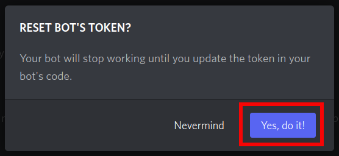
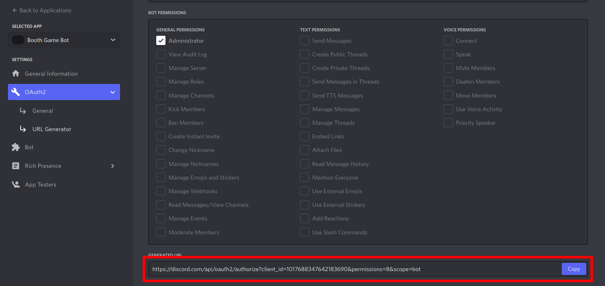

# PyCon APAC 2022 Discord Bot

This is a discord bot for running the PyCon APAC 2022 gather town games.

To run the bot, a running MySQL server is required.

## Setup

### Step 1 - Register a Discord Bot
Go to [Discord Developer portal](https://discord.com/developers/applications), create application, and generate the token for the bot.

Click the **New Application** beside your avatar icon.


Give your application a name and confirm.


On the left, navigate to the **Bot** section, and on the right click **Add Bot**.


To generate or reset the token, click **Reset Token**.




**IMPORTANT!!** The token will only show up once, so make sure you have copied and saved the token somewhere.


Scroll down to the **Privileged Gateway Intents** section, turn on the privileges, and save the changes.


### Step 2 - Create a discord server
Go to discord and open the app. On the left hand side, click the '+' icon to create a new server for the game.


Name the server and create. The server (guild) ID can be seen from the URL. This ID will be used in the later step.


### Step 3 - Invite the bot to the server.
Go back to the developer portal choose the application you've just created.
On the left, navigate to **OAuth2 -> URL Generator**. Then on the right, first click **bot** in the scope section, then the below **Bot Permissions** section will show up. Click **Administrator** to give the bot admin permissions. 


Then scroll down, you'll see a generated url. Open a new tab and go to that url.



First choose the server you want the bot to join. In our case, choose the server you've just created. After selection, click continue.


Confirm the invitation.


### Step 4 - Modify credentials recorded in `env.var`

``` bash
DISCORD_TOKEN=<your_bot_token_here>
DB_PASSWORD=<type_any_password_you_want>
TARGET_GUILD=<your_server_id>
```
You also have to modify the value of `MYSQL_ROOT_PASSWORD` in `docker-compose.yml`.
``` yaml
...
    environment:
      - MYSQL_ROOT_PASSWORD=<the_same_password_as_in_env_var>
...

```

### Step 5 - Run the bot to serve the game.

At the first time running, the bot will automatically create all channels, roles, and custom emojis to the guild (the server), which are necessary for the booth game.

``` bash
# Create the tmp folder for underlying services. Only need to do once.
mkdir /tmp/pybot22/mysqld

# Start MySQL database and run the bot.
docker-compose up

# Setup database tables and data. Only need to do once.
./scripts/init_db.sh
```

After the services' running, go to the discord server and send private message `!init_game` to the bot. This will initialize channels with  welcome message and start receiving events. You can play the booth game now!

If you find the bot doesn't respond to your emoji reactions, send private massage `!init_game` to the bot again to re-initialize the messages.

To stop the services, run `docker-compose stop`.
To restart the services, run `docker-compose start`.

## (Optional) Connect to the Database
It's recommened to use the third-party software to connect to the running database.
Here the recommened software is [TablePlus](https://tableplus.com/download). It's available on all platforms, including Linux distributions.

To setup the connection, fill in the information as below:

